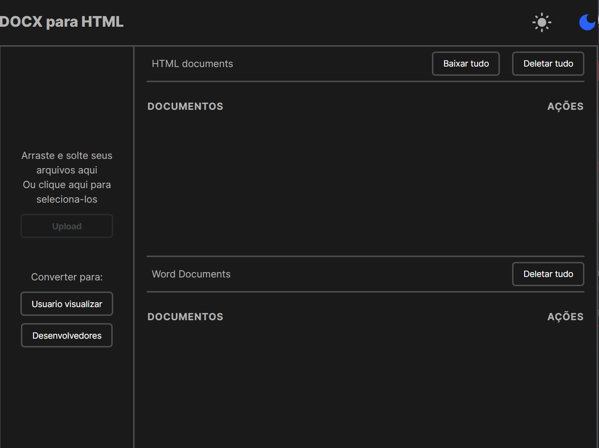
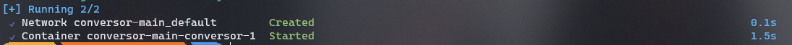
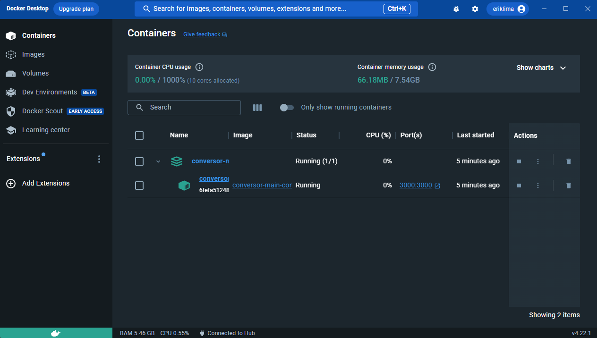
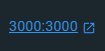
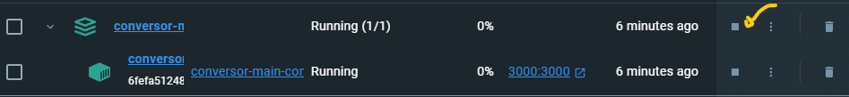

<h1 align="center"> 📖 Docx to HTML 🖥️</h1>

<div align="center" style=''>



</div>

## Instalar o docker

Aqui são os links para download direto de acordo com seu sistema operacional, com exeção do linux, que depois precisa escolher a sua distribuição.

[Docker para Windows](https://desktop.docker.com/win/main/amd64/Docker%20Desktop%20Installer.exe)
[Docker para MacOS Intel chip](https://desktop.docker.com/mac/main/amd64/Docker.dmg)
[Docker para MacOS Apple silicon](https://desktop.docker.com/mac/main/arm64/Docker.dmg)
[Docker para Linux Tutoriais de instalação](https://docs.docker.com/desktop/install/linux-install/)

## Download da pasta do projeto

Baixe o Zip abaixo e o salve na sua area de trabalho:

[Download da pasta Conversor-main.zip](https://github.com/Erik-EFL/Conversor/archive/refs/heads/main.zip)

Após o download concluido, descompacte a pasta, apois isso entre na pasta que foi extraida, se ouver outra
pasta com mesmo nome dentro a coloque-a na sua area de trabalho e a outra pode apagar, caso não haja so prossiga com o tutorial.

## Começando a usar

Entre dentro da pasta Conversor-main a pasta correta tera varios arquivos dentro.
Verifique se o docker esta em execução caso não esteja em execução o execute para poder prosseguir.
Apos o docker estar em execução abra o terminal do seu sistema operacional copie e cole
no seu terminal o comando abaixo:

```bash
docker compose up -d
```

aperte enter para execulato.

Apos isso vai se iniciar um processo de instalação que pode demorar um pouco pode levar 5 minutos ou mais dependendo do computador então da tempo de tomar um cafezinho.

Você sabera que o processo terminou quando seu ternimal estiver parecido com esse da imagem:



Apos ter essa confirmação, pode fexar o terminal e va até o Docker.
Ao chegar la você vai ver que tem algo a mais, e estara assim:



Por fim para executar a aplicação basta clicar no 3000:3000 como esta na foto:



Caso não seja o 3000:3000 seja outro pode clicar nele que funcionara da mesma forma.

Dica depois que termiar de usar, pare a execuçao do container pois ele consome recursos do seu computador. Ai quando for necessario pode iniciar a execução novamente.
Para parar a execução ou iniciala basta fazer como na imagem abaixo:


